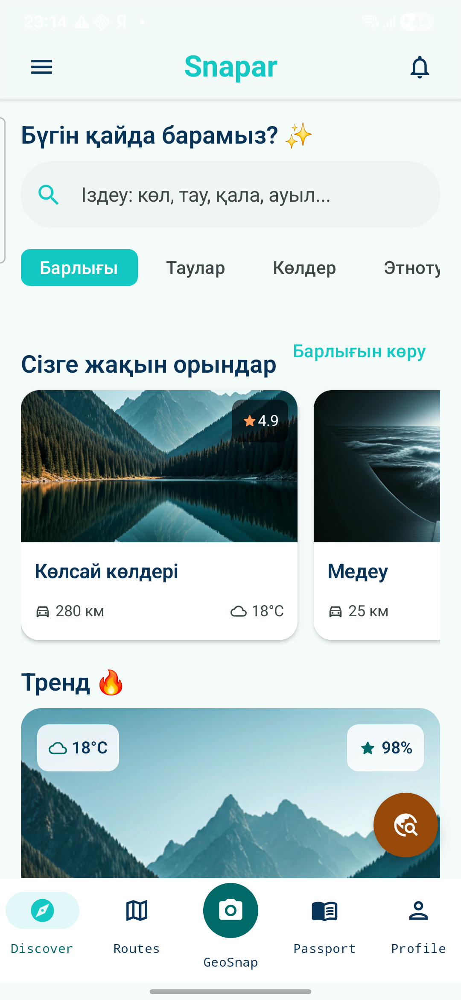

# Snapar Android

Қазақстанға бағытталған AI travel guide қолданбасының native Android MVP нұсқасы.

## Скриншот



## Жүктемей-ақ тексеру (браузерде ашу)

**[Try it live on Appetize.io →](https://appetize.io/app/b_w3ymx4xn6gun7gpqvwfi6xmcju)**

Сілтемені ашыңыз, "Tap to Start" басыңыз — қосымша браузерде виртуалды Android телефонда (Pixel 7, Android 13) тікелей іске қосылады. Ешнәрсе орнатудың қажеті жоқ.

## Технология

- Kotlin
- Jetpack Compose + Material 3
- Coil
- Android SDK 35
- Min SDK 26

## MVP экрандары

- Discover: іздеу, категориялар, ұсыныстар, лайк және сақтау
- Destination Detail: толық ақпарат, маусым, бюджет, SAI әрекеті
- Routes: карта, бағыт карточкалары, AI Route Builder
- GeoSnap: community feed және телефоннан фото таңдау
- Passport: XP, Қазақстан картасы, статистика және жетістіктер
- Profile: статистика, тіл/хабарлама баптаулары, бизнес режим
- SAI: Gemini арқылы жұмыс істейтін нақты AI сұхбаттасу (Cloudflare Worker backend) + офлайн fallback
- Live Weather: Open-Meteo арқылы нақты уақыттағы ауа райы және 7 күндік болжам

## Іске қосу

Жобаны Android Studio арқылы ашыңыз:

```text
C:\Users\Lenovo\OneDrive\Desktop\travel\snapar-android
```

Немесе PowerShell арқылы:

```powershell
.\gradlew.bat :app:assembleDebug
```

Debug APK:

```text
artifacts\Snapar-debug.apk
```

Телефон USB debugging арқылы қосылғанда:

```powershell
C:\Users\Lenovo\AppData\Local\Android\Sdk\platform-tools\adb.exe install -r artifacts\Snapar-debug.apk
```

Толық өнімдік жоспар: [docs/IMPLEMENTATION_PLAN.md](docs/IMPLEMENTATION_PLAN.md)

## Cloud SAI (Gemini)

Қосымша API кілтін APK ішіне сақтамайды. Нақты LLM кілті `backend/sai-worker` ішіндегі
Cloudflare Worker-де (Cloudflare secret ретінде) тұрады, ал Android тек соның қауіпсіз
HTTPS endpoint-іне сұраныс жібереді:

```powershell
.\gradlew.bat :app:assembleDebug -PSNAPAR_SAI_BACKEND_URL=https://snapar-sai.snapar.workers.dev
```

Endpoint `POST {"message":"...","language":"kk","app":"Snapar"}` қабылдап, Gemini-ден
алынған `{"reply":"..."}` қайтарады. URL берілмесе немесе Worker қолжетімсіз болса, SAI
автоматты түрде толық офлайн жоспарлаушыға көшеді (`SaiRepository.kt`).

Worker-ды өз алдыңызша қайта деплой ету:

```powershell
cd backend\sai-worker
npx wrangler login
npx wrangler secret put GEMINI_API_KEY
npx wrangler deploy
```
